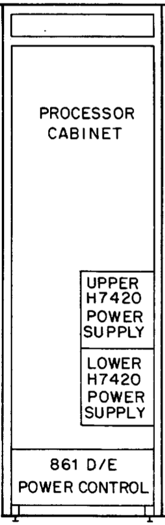
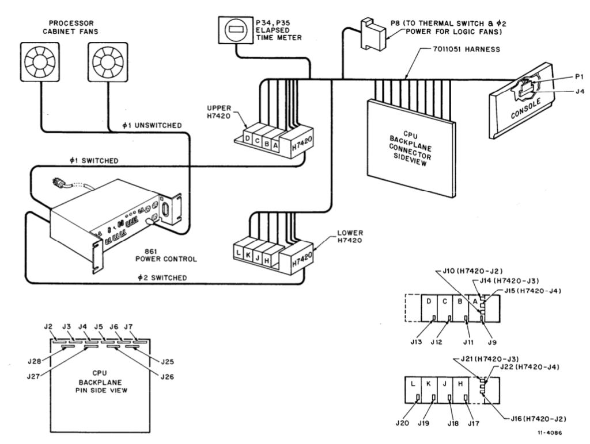
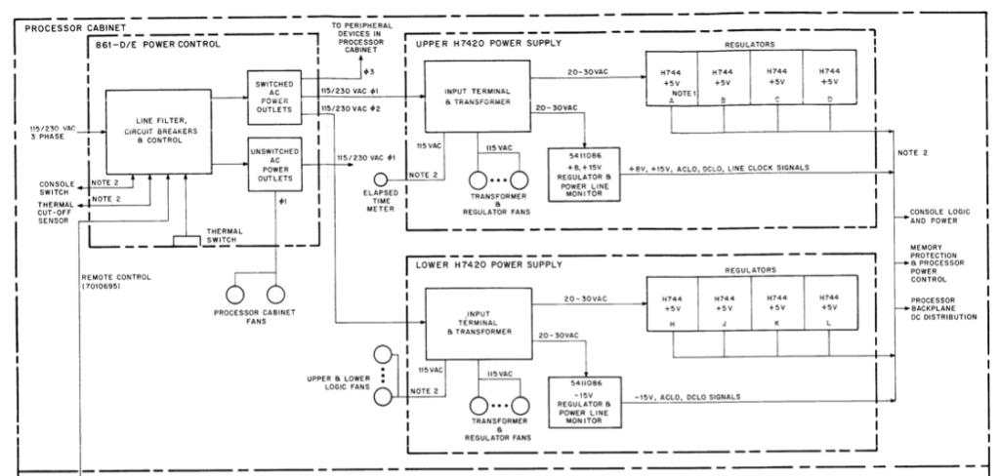
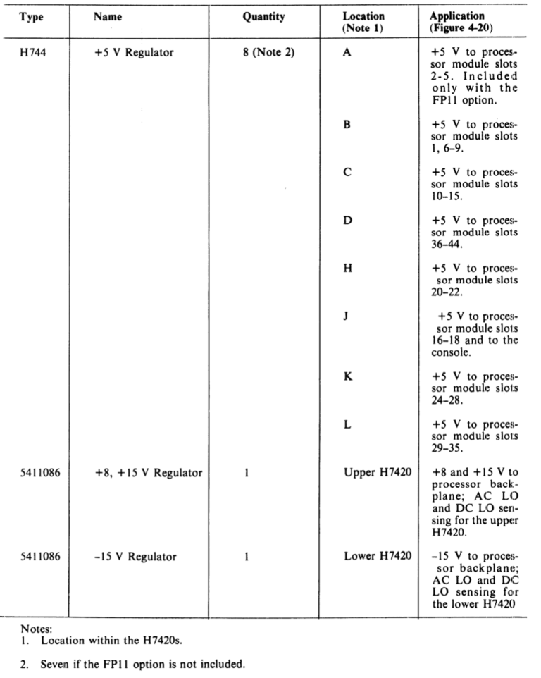

# Power Supply

The power supply of the 11/70 is quite a beast, and we expect to spend some time to ensure it is working properly.

The entire power system is described in detail in chapter 4 of PDP-11/70 maintenance and installation manual (EK-11070-MM)

_Power System, Physical Location in CPU Cabinet_

The power to the CPU goes through three stages in the processor cabinet. First through the 861-E power controller, then through the two H7420 power supplies, each containing four H744 +5V power regulators, before finally connecting through a cable harness to the CPU backplane and the front panel.

_Processor Cabinet Power Connections_

In addition, there are two 5411086 modules, one in each H7420. One provides +8V and +15V as well as a line clock. The other one provides -15V.

_Typical PDP-11/70 Power System_

The physical locations for each regulator can be found in the table below.

