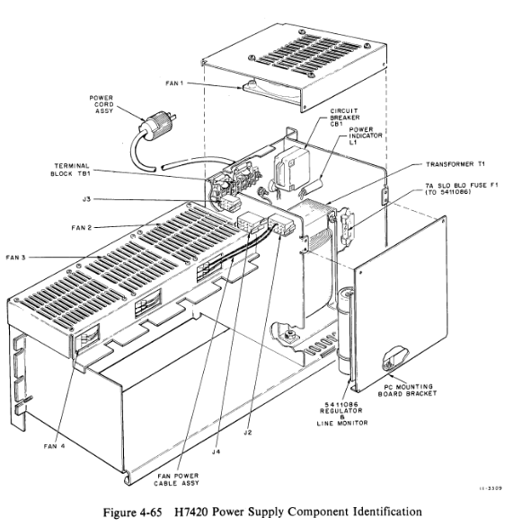

# 7420 Power Supply

This is the big and heavy part! It contains a massive transformer, up to five regulators and four 240V fans. Each +5V regulator will be removed and tested separately.

In the main body we find the transformer and the 5411086 regulator and monitor board. They are described on page 4-51 in EK11-11070-MM.