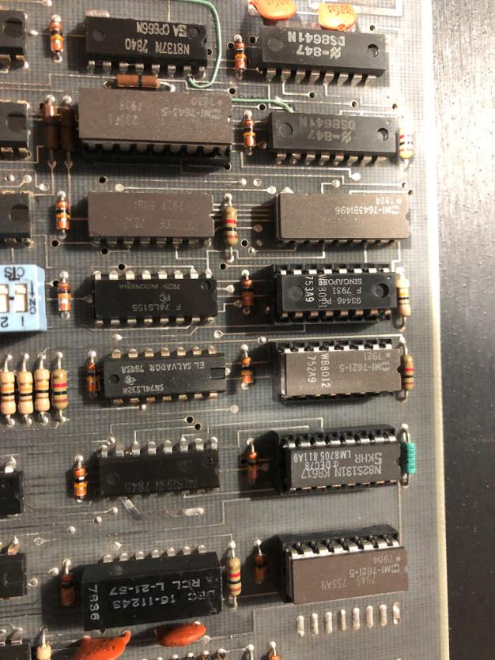

# Mass Storage

We have a few options:

- RA-disk, we have disk (RA90, RA72) but no controller (UDA50)
- RL-disk, we have controller(RL11) and drive(Rl01). Limited capacity
- RK-disk, an RK-05 would fit nicely in the cabinet
- SCSI, yeah.. we do have a UNIBUS SCSI card
- UNIBONE, and yes we have a unibone too.
- RM-disk, we have the controller(RH70). Getting a drive might be difficult, but not impossible.

## Boot ROMs

In order to boot from the devices listed above there needs to be a way to load the initial boot blocks. With older PDP models, like the PDP-8 the boot loader was entered manually with the front panel. But the 11/70 has a board, the M9301-YC, which is populated with 512 word ROMs for the devices that would be used for booting.

These are the boot ROMS on the M9301 board from our machine.

PART NO.	BOOT DEVICE
753A9	(DX) RX01 floppy disk, single density
752A9	(DM) RK06/07 cartridge disk
811A9	(DY) RX02 floppy disk, double density
755A9	(DP) RP02/03 cartridge disk
(DB) RP04/05/06,RM02/03/05 cartridge disk

More information (and images for other ROMS) can be found here:

- TM-001_M9301 Maintenance and Operations Manual
- http://gunkies.org/wiki/M9301_ROM
- http://www.ak6dn.com/PDP-11/M9312/

## TU16 Tape Drive

Not quite sure what our plans are for this. It would of course be nice to get this working and utilize the Massbus (RH70) controller. However, restoring this unit is probably a major project in itself.