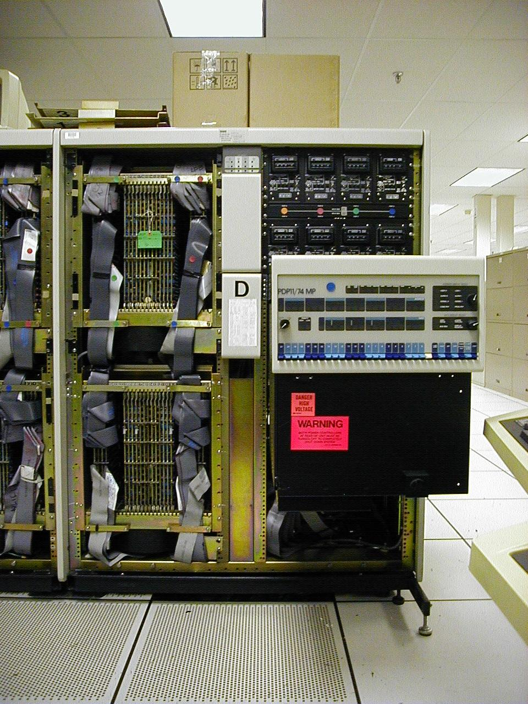

# Intro to the PDP-11/70

The history of the PDP-11/70, and PDP-11 in general, is described at length in other places. Therefore we will only describe what sets the 11/70 apart from other machines in the family. We suggest the curious reader check out the PDP-11/70 FAQ from which much of this information was taken.

- The first 22-bit implementation
- The only 22-bitter before the introduction of the F11 and J11 microprocessors
- The only UNIBUS machine with private memory bus
- Four MASSBUS controllers with direct memory access, not through the UNIBUS.
- Cache memory
- The fastest PDP-11! (well, almost, read on)
- Long Life!

The combination of a dedicated memory bus and MASSBUS controllers with access to that memory gave the PDP-11/70 unparalleled I/O performance. While the 11/55 and 11/83 CPU outperformed slightly, the 11/70 won on performance.

Introduced in 1975 and meant as a stop gap until a “wide word” machine would be released. Only 1000 was planned for but more than 10000 sold. As late as 1988 DDS/SETASI marketed and sold upgrades for the 11/70. More than 13 years in business is impressive for any computer.

No description of the 11/70 is complete without a mention of the 11/74. The multiprocessor 11/70. This was up to four 11/70 machines interconnected with a shared memory bus. The project, called Cerberus, was canceled due to complexity and feared difficulty of maintenance. However many believe the real reason is that the 11/74 would give the new VAX a run for its money.

At the same time, the 11/70 is reportedly hard to keep running and the memory from a single CPU connects with four unwieldy cables. Four processors would require 32 cables into every CPU!

