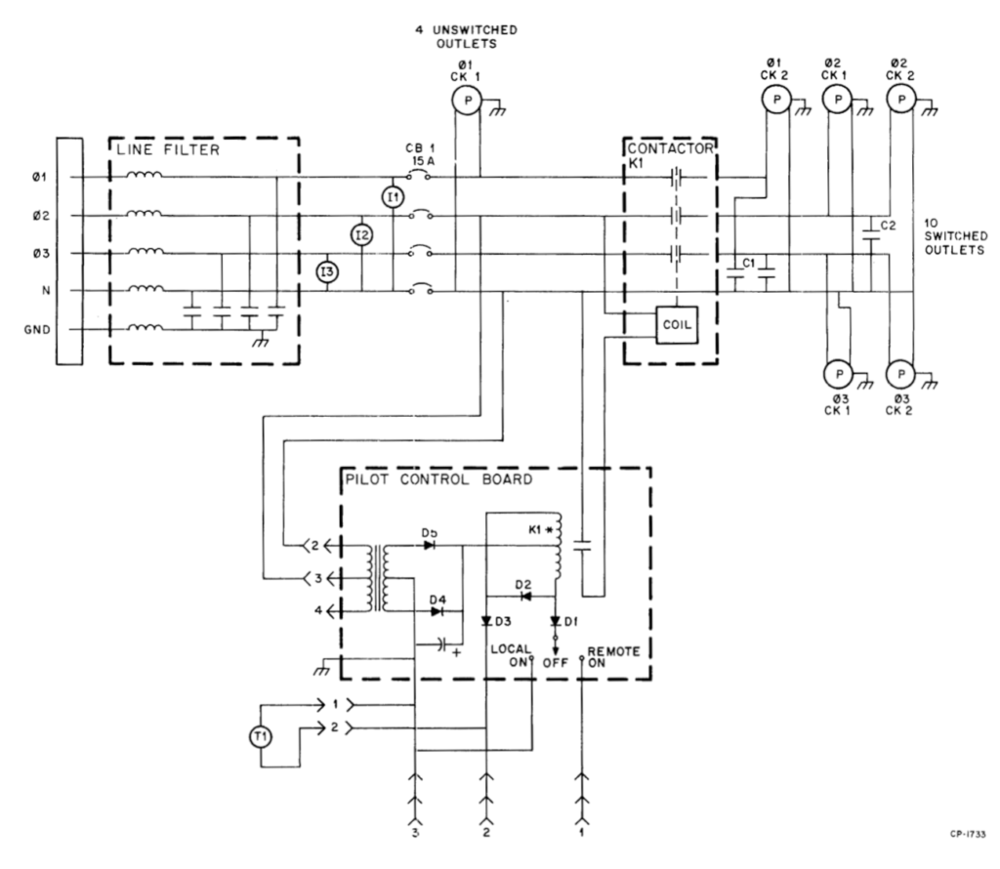
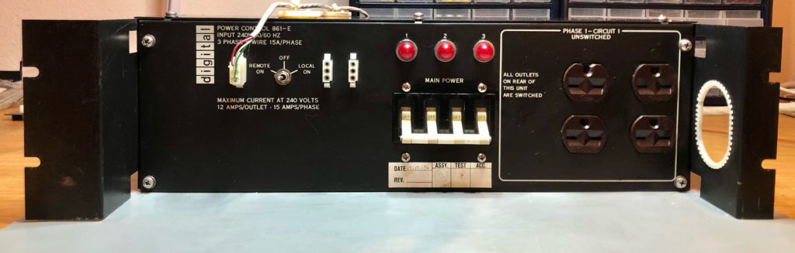
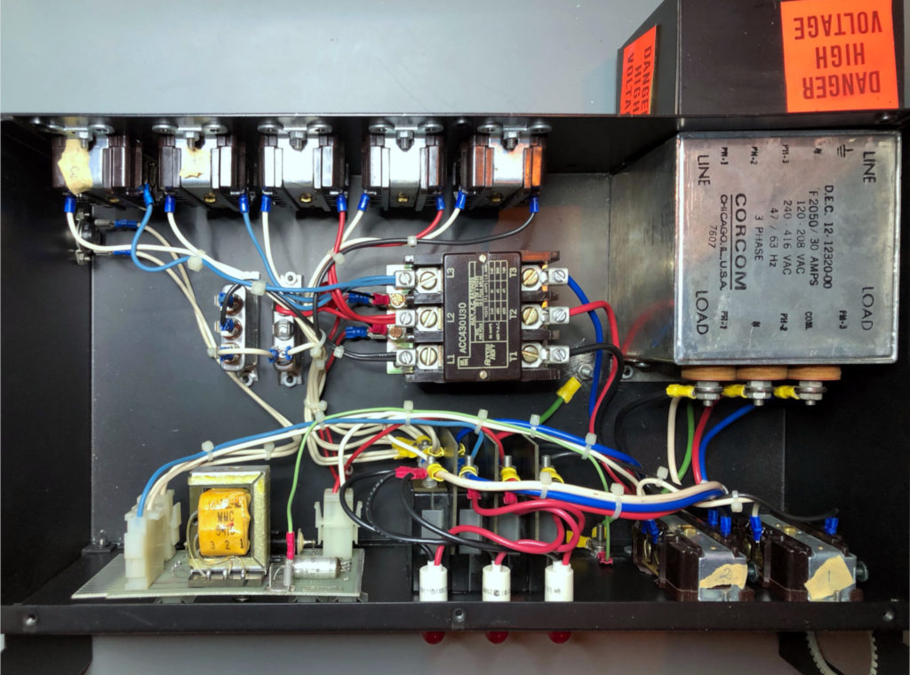
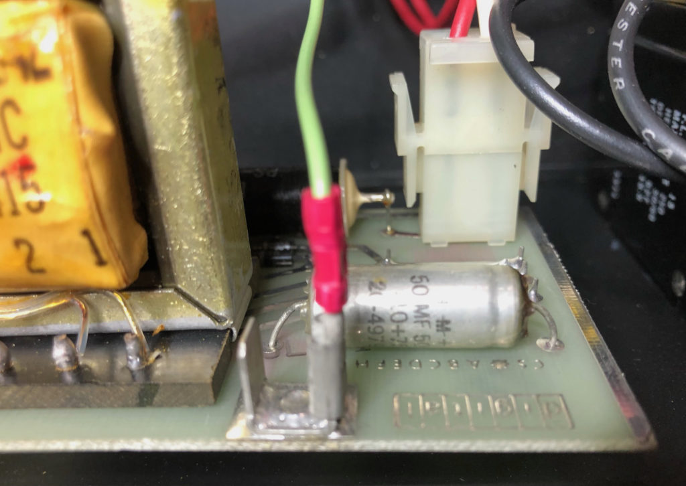
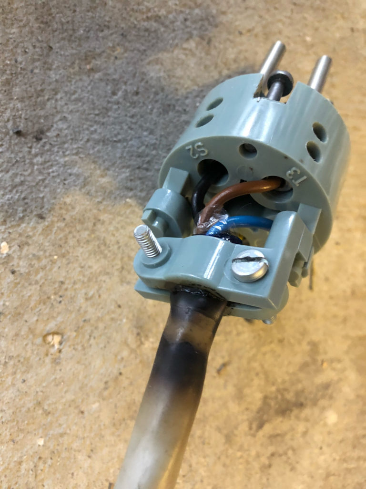
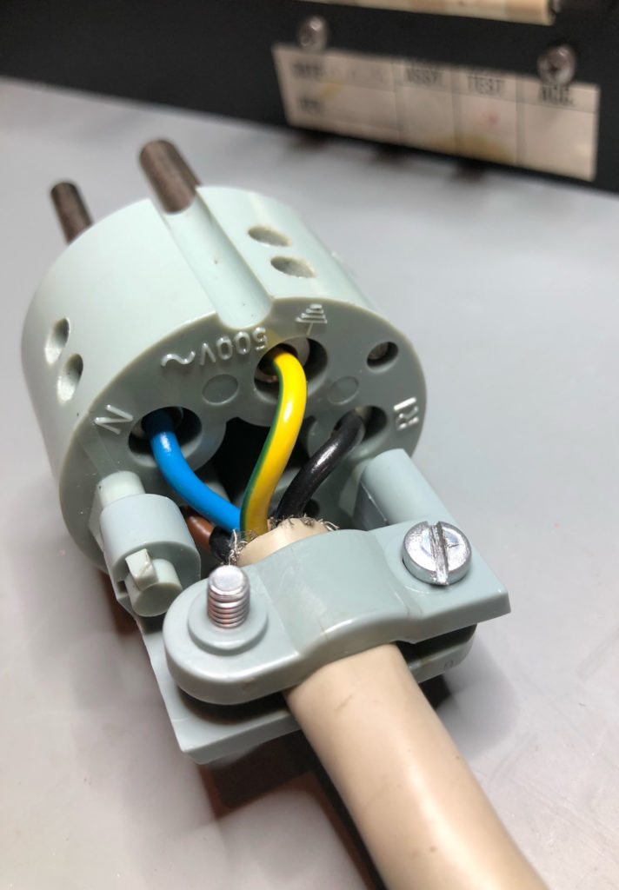
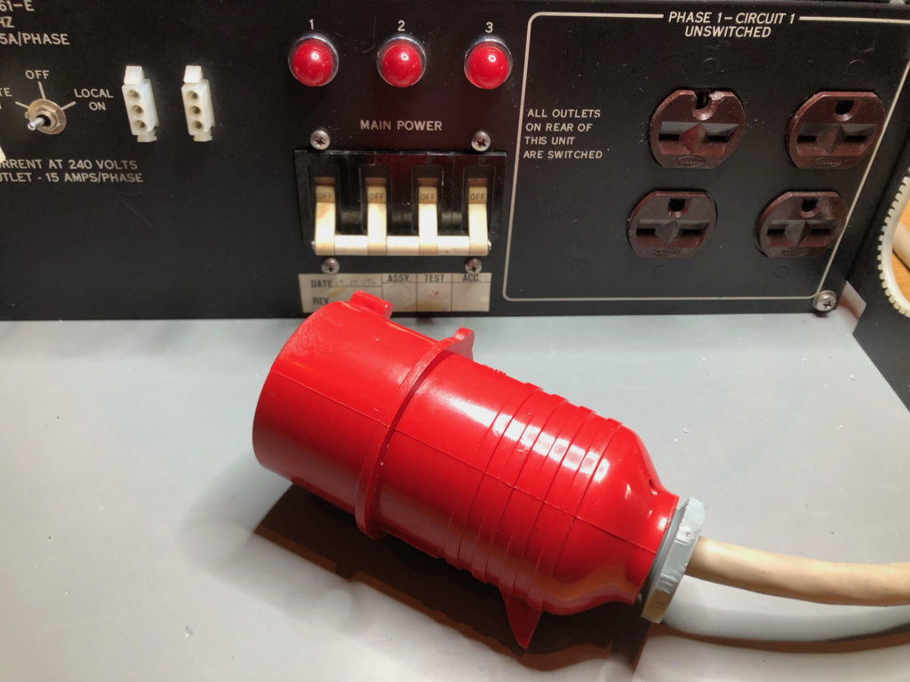
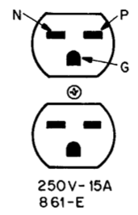

# 861-E Power Controller

The power control unit is controlling and distributing power to all parts of the system, possibly through other power control boxes in other racks. It is a fairly simple device, as seen from the schematic below.

The 861-E is intended for 180-264V (312-458V phase to phase), while the 861-D version is for 90-132V (156-229V phase to phase).

_861-E Simplified circuit schematic_

This is what it looks like on the bench after an initial cleaning of the exterior.

Looks good on the inside as well.

The capacitor on the pilot control board checked out fine (54uF, ESR=0.7ohm)

The capacitance was measured from each phase (and neutral) to ground in the power connector to check the capacitors in the line filter. In these measurements, some capacitance was probably added from the long power cable. The capacitors across the switched outputs were also measured (C1 and C2 in the schematic above). Specified and measured values are listed in the table below.

| Capacitor location    | Specified  | Measured   | Vloss |
|-----------------------|------------|------------|-------|
| Line filter, phase 1  | 30nF       | 51nF       | 0.3%  |
| Line filter, phase 2  | 30nF       | 47nF       | 0.3%  |
| Line filter, phase 3  | 30nF       | 47nF       | 0.3%  |
| Line filter, neutral  | 30nF       | 47nF       | 0.3%  |
| Output, phase 1       | 100nF      | 106nF      | 0.1%  |
| Output, phase 2       | 100nF      | 107nF      | 0.1%  |
| Output, phase 3       | 100nF      | 100nF      | 0.1%  |

When taking the power controller out of the CPU cabinet, the 3 phase plug had to be removed. It looked like it had been running quite hot, and the isolation on the cables near the plug was brittle. 10-15 cm of the cable was cut off before the plug was mounted.

_3 phase power plug before and after_

_Only serious computers have 400V 3 phase plugs_

Everything now looks fine in the power controller, but we are not able to fully test it until we have access to a 230V three phase outlet, i.e. 400V between phases (not commonly available in Norwegian domestic buildings).

_Power plugs used on the 861-E and corresponding cables to power supplies._

At least as a temporary solution, we should build converter cables from the NEMA 6-15R 250V plugs (see above) to the European style plug to connect the power supplies directly to mains instead of through the 861-E.

A couple of these should work: https://no.mouser.com/ProductDetail/Qualtek/Q-722-BW?qs=BXmE%252BJ0Y7xam28jusjp7Eg==
