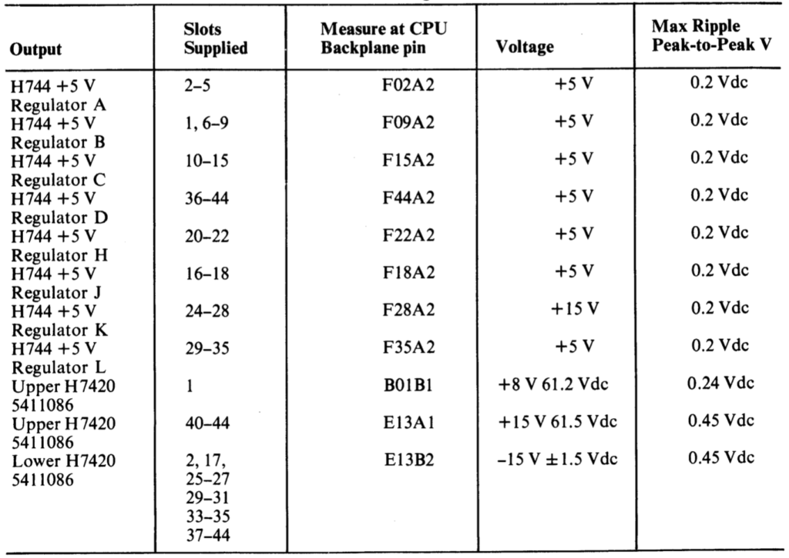

# Backplane

The last endevour in making sure the power supply is working properly means taking out all of the cards in the card cage and inspect for debris and damage. At this stage we can connect the power supply to the backplane and turn the power on. EK-11070-MM lists test points on the backplane were we will double check voltages before beginning to populate the system with cards and move on to testing the CPU.

The expected voltages at the backplane can be found in the table below.

The card chassi contains ten(10!) 240V fans that we should take the oportunity to test and maybe service.