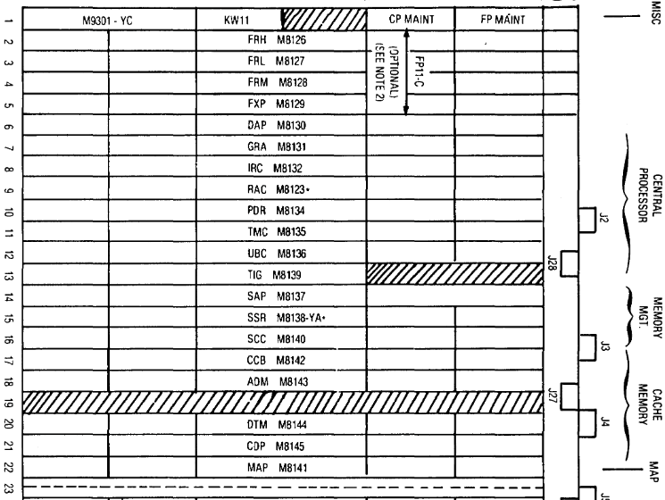
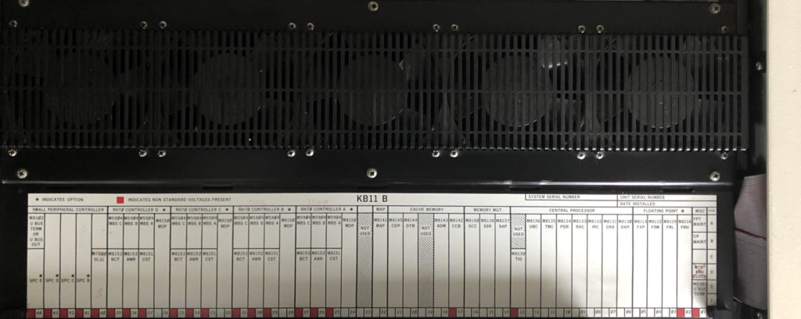
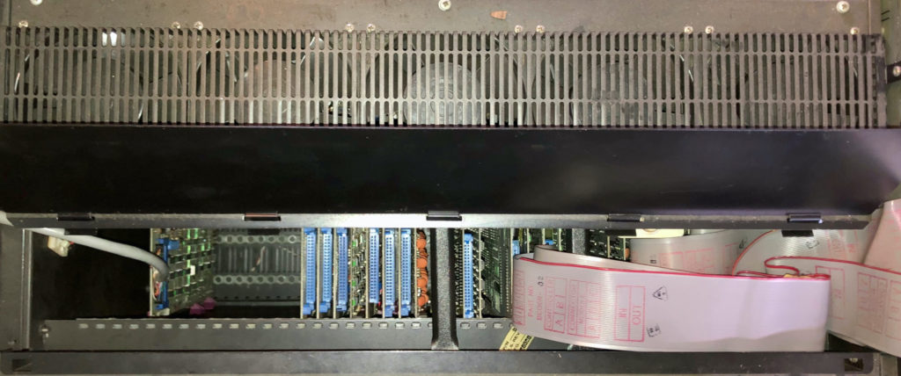

# CPU

Ok, so the power supply checks out. What now? First we can check the lightbulbs on the frontpanel with the light test switch (the white one).

Before re-inserting any of the boards, visual inspection for anything obvious will of course be performed and any cleaning as needed. Also checking that there are no shorts for any of the power rails.

While reinserting the boards we should make note of the board revisions, any jumper settings (as described on page 29 and onwards in the 1170 Maintenance Service guide (KA-1170-MG))

The CPU is seated in the first 22 slots of the backplane. Slot 19 is always empty (unless you have PEP70/HC70 memory upgrade). Slot 23 is probably a seam between backplanes. Slots 24 to 39 contains up to four RH70 Massbus controllers. Slot 40 is usually the serial console and the last four slots are UNIBUS.

Our machine does not have the floating point option, so slots 2 to 5 is empty.

It seems that the CPU will need to go in all at once to perform any meaningful tests. The Cache can be disabled for some tests but probably needs to be inserted.

A simpler second test would be to load data into memory, however.. we don’t have any memory. That also means we can’t run XXDP diagnostics. But read on.

# Cache

But the cache of the 11/70 can be used to do simple diagnostics, it contains “PAR” which are addressable registers where you can put instructions and perform limited testing of the CPU and Cache subsystem. This is described in chapter 5.1.3 in [EK-11070-MM](../../assets/manuals/EK-11070-MM-002,PDP-11-70_Maintenance_and_Installation_Manual,1979-05.pdf) and will give a first indication of the health status of the machine.

There is further reading in KA-1170-MG.
