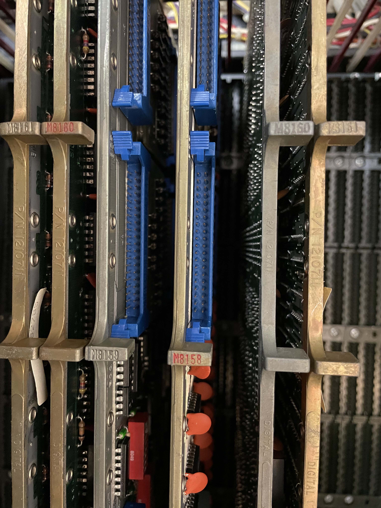
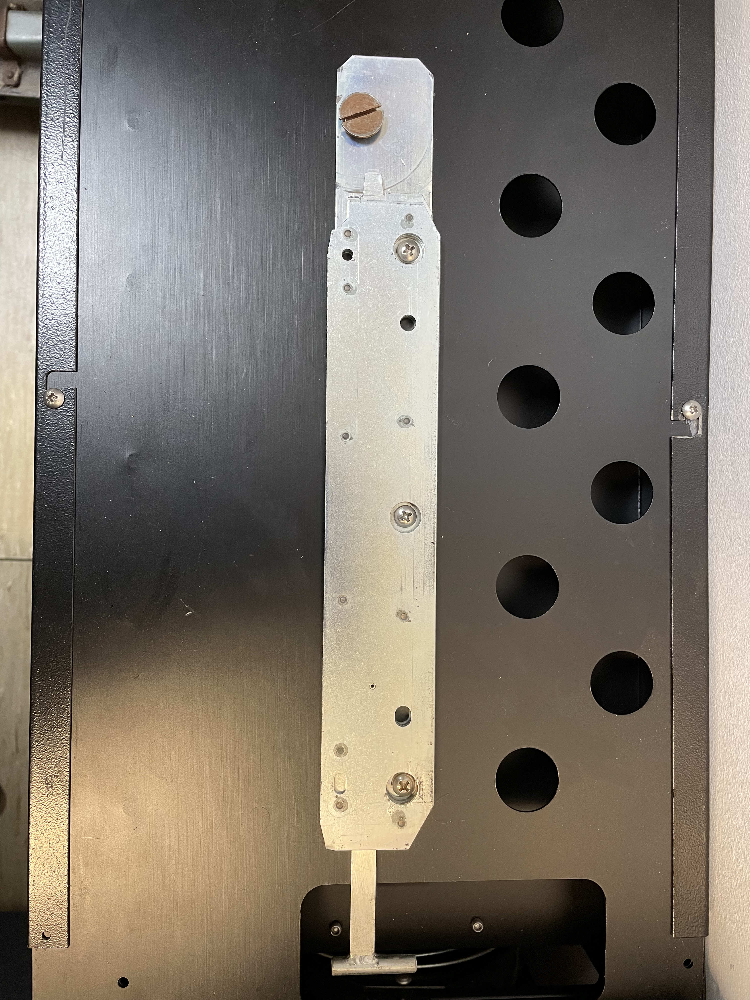

# Memory

The machine didn't come with any memory. But we have since been given a MK11 box. It consists of a power supply, backplane, controller and memory boards. Our box lacks the memory 
boards so the search continues for a working solution.

Side view of the box:

Memory controller cards:

