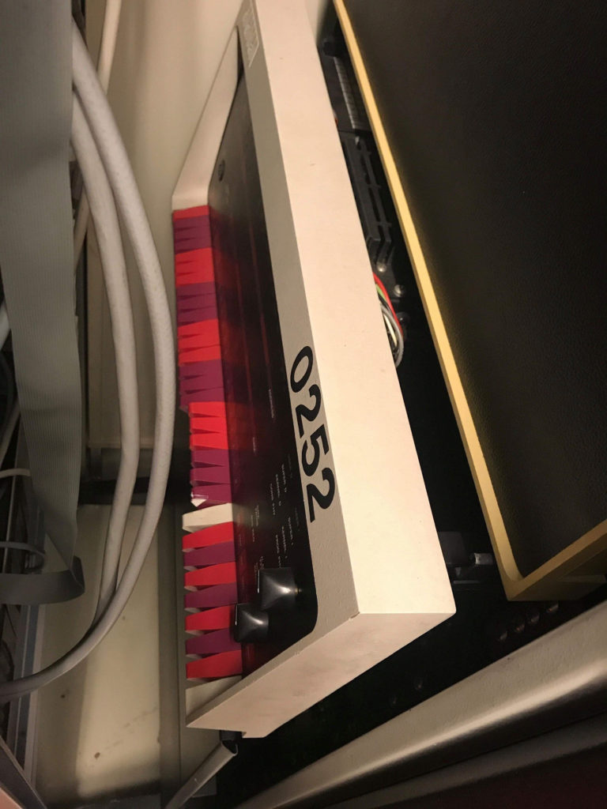
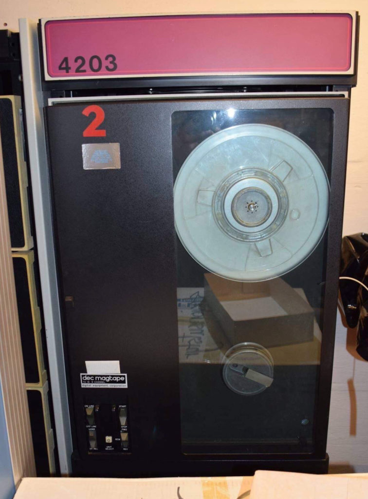
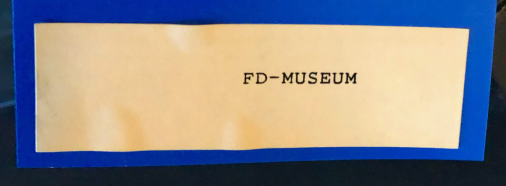
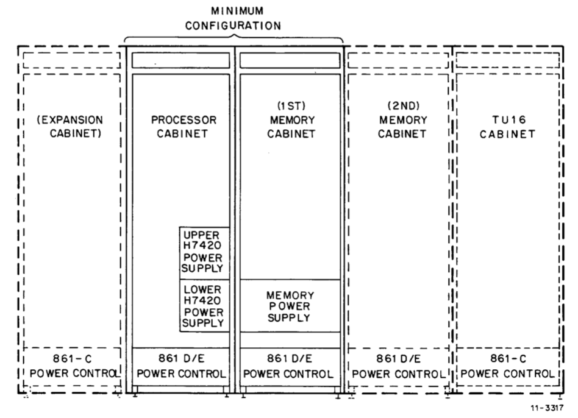

# History of our machine

It’s probably difficult to find out exactly what this PDP-11/70 was used for. It originally came from “Fellesdata AS” in Oslo, Norway. Fellesdata was later acquired by EDB Business Partner (later renamed to Evry), which subsequently merged with Tieto. Fellesdata had major clients in both finance (Sparebanken Nor, Sparebank 1, banks in the Eika-group, Handelsbanken and Vår Bank) and the oil industry (Statoil).

Pictures of the machine as found in storage in 2018

The machine was in storage for many years and was intended to be put on display in Fellesdata’s IT museum (it is still labeled with “FD-Museum”), which to the best of our knowledge never materialized.

In early 2019, the machine was rescued by Movement AS when Evry relocated their office at Skøyen in Oslo.

This PDP-11/70 should have had at least one more cabinet containing the memory (core memory MJ11 or MOS memory MK11), but this may have been scrapped a long time ago or reused with another machine.

In pictures from the storage room at Skøyen, there is a hint of an RP06 that most likely was used as the disk system for this PDP-11/70. Unfortunately, this was not rescued.

In early 2021, Pontus and Lars acquired the machine in an auction, with the aim to restore it to a fully functional system realizing this will be a long-term project.