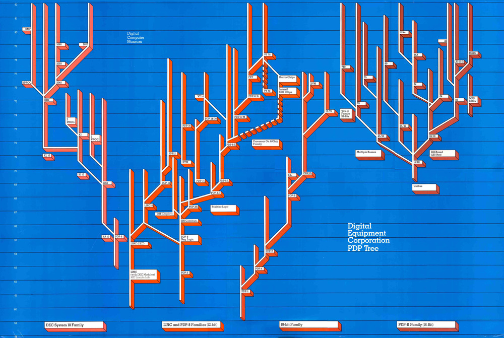

# Digital Equipment Corporation (DEC)

There are several sites documenting the history of Digital Equipment Corporation (DEC), including:

[Wikipedia](https://en.wikipedia.org/wiki/Digital_Equipment_Corporation)  
[Computer History Museum](https://www.computerhistory.org/brochures/d-f/digital-equipment-corporation-dec/)  

There is also a [book](./assets/books/DEC_1957_to_the_Present,1978.pdf) written about "DEC from 1957 to the present", with present being the late 1970s.

The Programmed Data Processor (PDP) machines are wellknown minicomputers developed by DEC.

The families of PDP machines developed between 1959 to 1982 are depicted below [Digital Computer Museum]

This site is primarily intended to document the ongoing restoration of DEC computers by a few computer history enthusiasts in Sweden and Norway.

